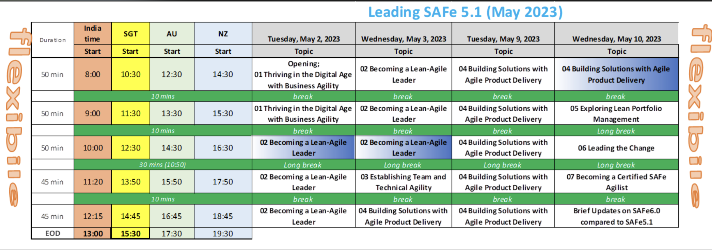

# Sample page
A tool is an object that can extend an individual's ability to modify features of the surrounding environment or help them accomplish a particular task. Although many animals use simple tools, only human beings, whose use of stone tools dates back hundreds of millennia, have been observed using tools to make other tools.

Early human tools, made of such materials as stone, bone, and wood, were used for preparation of food, hunting, manufacture of weapons, and working of materials to produce clothing and useful artifacts and crafts such as pottery, along with the construction of housing, businesses, infrastructure and transportation. The development of metalworking made additional types of tools possible. Harnessing energy sources, such as animal power, wind, or steam, allowed increasingly complex tools to produce an even larger range of items, with the Industrial Revolution marking an inflection point in the use of tools. The introduction of widespread automation in the 19th and 20th centuries allowed tools to operate with minimal human supervision, further increasing the productivity of human labor.

By extension, concepts which support systematic or investigative thought are often referred to as "tools" or as "toolkits".

## Embeding external links 
Please see the [project license](license.md) for further details.

## Embeding images 


## Code sample
```python
    encryptionSequence = 4;
    if (remoteEBitrate(heuristic(data_frozen, tweakPrinter, 47), isp,
            systray_class_flowchart)) {
        bareNewsgroup = -5 + dvBoot;
        iphoneSoft = default;
    } else {
        minicomputer_superscalar(processor(markup, bitmap, twainFormatHalf));
    }
    reader.adwareTape -= megabit(4 + -5, file * bit_cross +
            heat_networking_suffix);
```
# Defining Table
String | Numeric | Special char
- | -- | ---:
test string | 230.141 | #$%sd
temp 12345 | 1.2  | ^$Q#E